# MNIST with Pattern Completion Learning

### Quick run 

`python ae_classifier.py [--model {flatten,dense_cnn,cnn}]` 

 

Pattern completion learning (PCL) is an inference strategy where given data pairs (X,Y), a PCL model tries to learn correlation between the latent representations of the partial pattern (X) and the complete pattern (XY). The main advantage of PCL is after learning the latent representations, downstream tasks can be learn fast and with high quality. 

#### Our procedure 

For MNIST dataset, X represents the handwritten digit image (28x28 matrix) and Y, the image label (10 dimentional one-hot vector). XY is the contatenation of the two data types. 

In our experiement, the proceedure is the following:

1. Use an autoencoder to learn the latent representations of labels (X), images (Y) and label-image compounds (XY). The latent representation space is set to 32 dimension with each bounded between 0 and 1.
2. Learn completion functions for each of the following tasks: classification and generation. For classification, X is the partial pattern. For generation, Y is the partial pattern. The completion function models the correlation between the partial and its complete pattern (XY). For the output, we ignore input partial pattern.

We test between the two completion functions:

1. Vector addition (ADD). 
2. Single dense layer network (SDL) with bias and no regularization. 

#### Details on vector addition 

We take the average difference `d` between the latent representations of the complete pattern (XY) and the partial pattern (X or Y) in the training set. At inference, on input X', do X'+`d` to obtain the predicted completion for X'. 

#### Packages dependencies 

Keras 2.1.3

Matplotlib 2.1.0 (for the figures)

## Autoencoding models

We test three different autoencoders. They are all defined in file `autoencoders/models.py`.

##### Flatten
(`Flatten_AE`) Encoder and decoder each have three dense layers.

##### Dense+CNN 
(`Dense_CNN_AE`) Use a dense layer to reduce input (XY) in a vector that can be reshaped to a size of 28x28x1. Then treat the rest as an image through a convolutional autoencoder. Last layer in the decoder is a dense layer that outputs a vector of size 28x28 + 10.

##### 2chan-CNN 
(`CNN_AE`) Use a dense layer to map input (XY) to a vector that can be reshaped to a size of 28x28. Append this vector to the input digit (X). Reshape the result into a 28x28x2 matrix and treat it as an image (with 2 channels) through a convolutional autoencoder. Use the same decoder as the previous model. 

## Baselines
1. FN: end-to-end foward network, `baselines\flatten_classifier.py` and `baselines\flatten_generator.py`.
2. CNN: end-to-end convolutional network, `baselines\cnn_classifier.py` and `baselines\cnn_generator.py`.

## Results

### Autoencoding

Model | Loss (`binary_cross_entropy`) | L1 Distance
--- | --- | ----
Flatten | 0.1109 | 0.0492
Dense+CNN |  0.0897 | 0.0314
2chan-CNN  | 0.0844 | 0.0285

### Classification 
Input handwritten digit, output class as a probability vector. 

<table>
  <tr>
    <th rowspan="2">Learning paradigm</th>
    <th rowspan="2">Model</th>
    <th colspan="3">Accuracy</th>
  </tr>
  <tr>
    <td></td>
    <td>ADD</td>
    <td>SDL</td>
  </tr>
  <tr>
    <td rowspan="2">End-to-End (E2E)</td>
    <td>FN</td>
    <td>0.9797</td>
    <td>-</td>
    <td>-</td>
  </tr>
  <tr>
    <td>CNN</td>
    <td>0.9907</td>
    <td>-</td>
    <td>-</td>
  </tr>
  <tr>
    <td rowspan="3">Feature extraction</td>
    <td>Flatten</td>
    <td>0.8989</td>
    <td>-</td>
    <td>-</td>
  <tr>
    <td>Dense+CNN</td>
    <td>0.8362</td>
    <td>-</td>
    <td>-</td>
  <tr>
    <td>2chan-CNN </td>
    <td>0.8360</td>
    <td>-</td>
    <td>-</td>
  </tr>
  <tr>
    <td rowspan="3">Pattern matching</td>
    <td>Flatten</td>
    <td>-</td>
    <td>0.7457</td>
    <td>0.7733</td>
  </tr>
  <tr>
    <td>Dense+CNN</td>
    <td>-</td>
    <td>0.5832</td>
    <td>0.7035</td>
  </tr>
  <tr>
    <td>2chan-CNN </td>
    <td>-</td>
    <td>0.4392</td>
    <td>0.6502</td>
  </tr>
  <tr>
    <td rowspan="3">Pattern completion  (learn both X --> XY and Y --> XY together)</td>
    <td>Flatten</td>
    <td>-</td>
    <td>0.8498</td>
    <td>0.9097</td>
  </tr>
  <tr>
    <td>Dense+CNN</td>
    <td>-</td>
    <td>0.7641</td>
    <td>0.9067</td>
  </tr>
  <tr>
    <td>2chan-CNN </td>
    <td>-</td>
    <td>0.6026</td>
    <td>0.9559</td>
  </tr>
  <tr>
    <td rowspan="3">Pattern completion (PCL)</td>
    <td>Flatten</td>
    <td>-</td>
    <td>0.9240</td>
    <td>0.9212</td>
  </tr>
  <tr>
    <td>Dense+CNN</td>
    <td>-</td>
    <td>0.9723</td>
    <td>0.9741</td>
  </tr>
  <tr>
    <td>2chan-CNN </td>
    <td>-</td>
    <td>0.9822</td>
    <td>0.9810</td>
  </tr>
</table>

### Generation from labels 
Input one-hot encoded label, output handwritten digit.

<table>
  <tr>
    <th>Learning paradigm</th>
    <th>Model</th>
    <th>Result</th>
  </tr>
  <tr>
    <td rowspan="2">E2E</td>
    <td>FN</td>
    <td>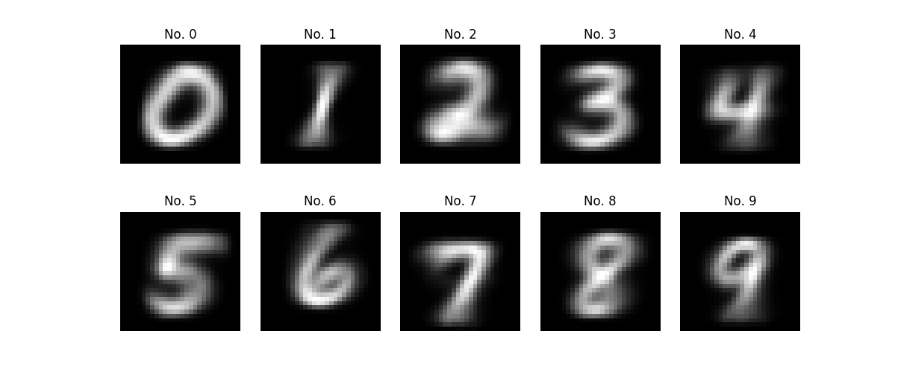</td>
  </tr>
  <tr>
   <td>CNN</td>
    <td>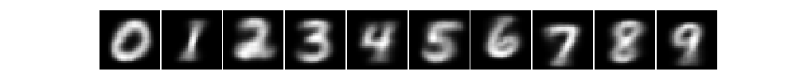</td>
  </tr>

  <tr>
    <td rowspan="6">PCL</td>
    <td>Flatten + ADD</td>
    <td>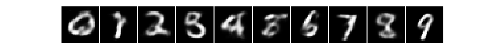</td>
  <tr>
    <td>Flatten + SDL</td>
    <td>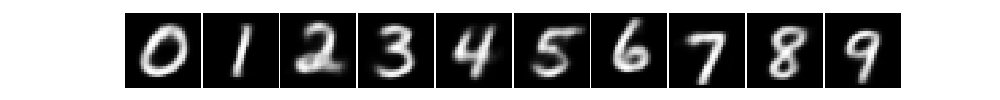</td>
  </tr>
  <tr>
    <td>Dense+CNN + ADD</td>
    <td>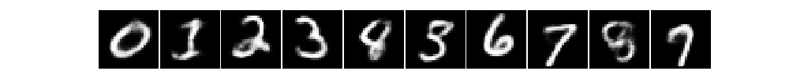</td>
  </tr>
  <tr>
    <td>Dense+CNN + SDL</td>
    <td>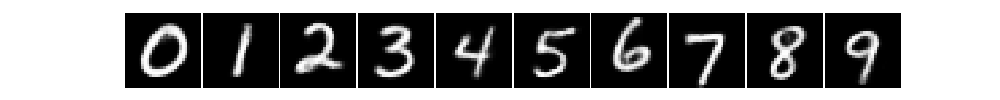</td>
  </tr>
  <tr>
    <td>2chan-CNN  + ADD</td>
    <td>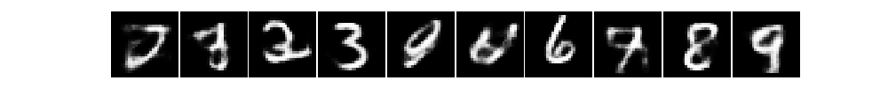</td>
  </tr>
  <tr>
    <td>2chan-CNN  + SDL</td>
    <td>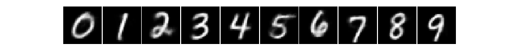</td>
  </tr>

</table>

#### Adding noise

Adding random gaussian noise to the latent representation of the generated digit, output from SDL. The center digit has zero noise, the digits on the first layer around the center has 50% of the mean STD, and those on the last layer has 100% of the mean STD. (STD is the standard deviation of the difference computed for ADD.)

<table>
  <tr>
    <td>Flatten</td>
    <td>Dense+CNN</td>
    <td>2chan-CNN</td>
  </tr>
  <tr>
    <td>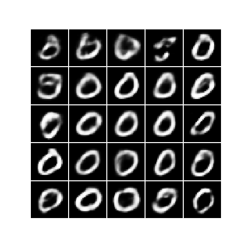</td>
    <td>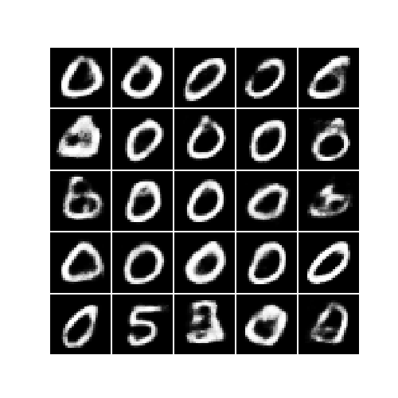</td>
    <td>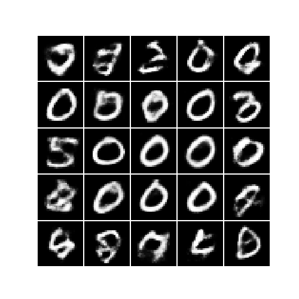</td>
  </tr>
</table>

## Discussion

- PCL requires good latent representations to guarantee high performance for downstream tasks.
- Adding noise the output of SDL can generate blurry or invalid digits. (This might get fixed by adding an adversarial component?)
- In Dense+CNN the first dense layer mixes the digit image with the label information, thus important features in the digit image might be lost. Alternatively, 2chan-CNN stores the original image as a seperate channel, which can avoid such loss. 

## Reference
Yi Tian Xu, Yaqiao Li, David Meger, Human motion prediction via pattern completion in latent representation space, CRV 2019 (16th conference on Computer and Robot Vision). [project link](http://www.cim.mcgill.ca/~yxu219/human_motion_prediction.html?)

