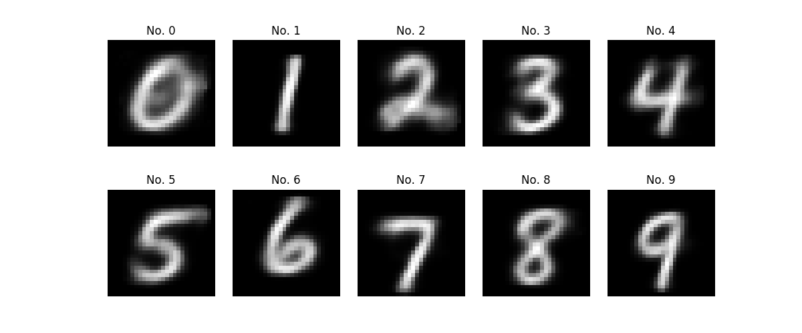

# MNIST via pattern completion

## Flatten autoencoder 

### Autoencoding
Test loss: 0.12039102125167847
Test accuracy: 0.05656530033349991

### Classification 
#### Feature extraction
Test loss: 0.32643666878938676
Test accuracy: 0.9035

#### Pattern matching
Test loss: 1.7577528305053711
Test accuracy: 0.7784

#### Pattern completion 
Test loss: 1.9479425233840943
Test accuracy: 0.9256

#### Pattern completion (all)
Test loss: 1.9667385452270507
Test accuracy: 0.895

### Generation from labels via pattern completion

