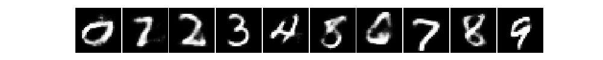

# MNIST via Pattern Completion Learning

Pattern completion learning (PCL) is an inference strategy where given data pairs (X,Y), a PCL model tries to learn correlation between the latent representations of the partial pattern (X) and the complete pattern (XY). The main advantage of PCL is after learning the latent representations, downstream tasks can be learn fast and with high quality. 

For MNIST dataset, X represents the handwritten digit image (28x28 matrix) and Y, the image label (10 dimentional one-hot vector). XY is the contatenation of the two data types. 

In our experiement, the proceedure is the following:

1. Use an autoencoder to learn the latent representations of labels (X), images (Y) and label-image compounds (XY). The latent representation space is set to 32 dimension with each bounded between 0 and 1.
2. Learn completion functions for each of the following tasks: classification and generation. For classification, X is the partial pattern. For generation, Y is the partial pattern. The completion function models the correlation between the partial and its complete pattern (XY). For the output, we ignore input partial pattern.

We test between the two completion functions:

1. Vector addition (ADD). 
2. Single dense layer network (SDL) with bias and no regularization. 

#### Details on vector addition 

We take the average difference `d` between the latent representations of the complete pattern (XY) and the partial pattern (X or Y) in the training set. At inference, on input X', do X'+`d` to obtain the predicted completion for X'. 

#### Packages dependencies 

Keras 2.1.3

Matplotlib 2.1.0 (for the figures)

## Results

### Autoencoding

Model | Loss (`binary_cross_entropy`) | L1 Distance
--- | --- | ----
Flatten | 0.1109 | 0.0492
CNN |  0.0897 | 0.0314

### Classification 
Input handwritten digit, output class as a probability vector. 

<table>
  <tr>
    <th rowspan="2">Learning strategy</th>
    <th rowspan="2">Latent mapping</th>
    <th colspan="2">Accuracy</th>
  </tr>
  <tr>
    <td>Flatten</td>
    <td>CNN</td>
  </tr>
  <tr>
    <td>Feature extraction</td>
    <td>-</td>
    <td>0.8989</td>
    <td>0.8362</td>
  </tr>
  <tr>
    <td rowspan="2">Pattern matching</td>
    <td>SDL</td>
    <td>0.7733</td>
    <td>0.7035</td>
  </tr>
  <tr>
    <td>ADD</td>
    <td>0.7457</td>
    <td>0.5832</td>
  </tr>
  <tr>
    <td rowspan="2">Pattern completion</td>
    <td>SDL</td>
    <td>0.9212</td>
    <td>0.9741</td>
  </tr>
  <tr>
    <td>ADD</td>
    <td>0.9240</td>
    <td>0.9723</td>
  </tr>
  <tr>
    <td rowspan="2">Pattern completion (learn both X --> XY and Y --> XY together)</td>
    <td>SDL</td>
    <td>0.9097</td>
    <td>0.9067</td>
  </tr>
  <tr>
    <td>ADD</td>
    <td>0.8498</td>
    <td>0.7641</td>
  </tr>
</table>

### Generation from labels 
Input one-hot encoded label, output handwritten digit.

<table>
  <tr>
    <th>Model</th>
    <th>Method</th>
    <th>Result</th>
  </tr>
  <tr>
    <td rowspan="3">Flatten</td>
    <td>End-to-End</td>
    <td></td>
  </tr>
  <tr>
    <td>Pattern completion (ADD)</td>
    <td></td>
  </tr>
  <tr>
    <td>Pattern completion (SDL)</td>
    <td></td>
  </tr>
  <tr>
    <td rowspan="3">CNN</td>
    <td>End-to-End</td>
    <td></td>
  </tr>
  <tr>
    <td>Pattern completion (ADD)</td>
    <td></td>
  </tr>
  <tr>
    <td>Pattern completion (SDL)</td>
    <td></td>
  </tr>
</table>

Adding gaussian noise to the latent representation of the generated digit. The center digit has zero noise, the digits on the first layer around the center has 50% of the mean STD, and those on the last layer has 100% of the mean STD. 

<table>
  <tr>
    <td>Flatten</td>
    <td>CNN</td>
  </tr>
  <tr>
    <td></td>
    <td></td>
  </tr>
</table>
